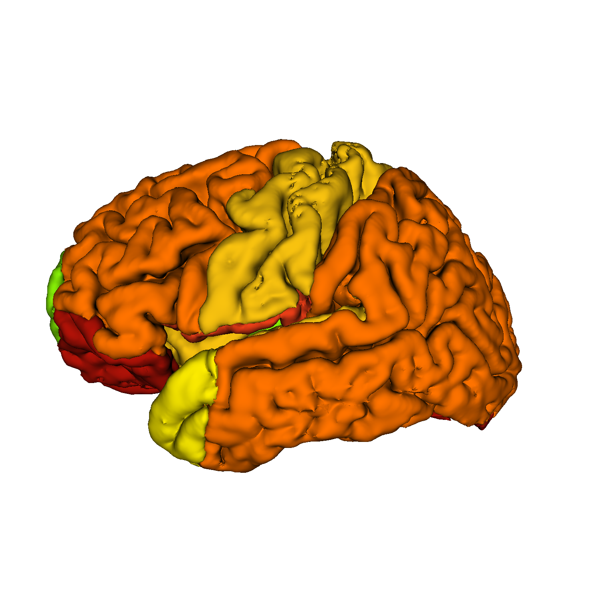
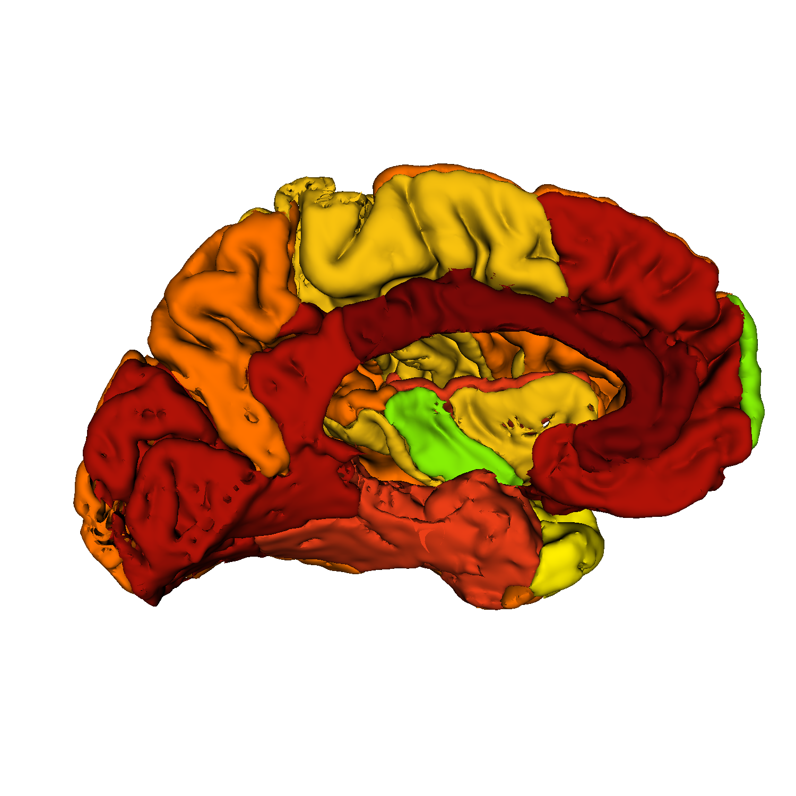

# vtkSnap
A simple, command-line image render and snapshot tool for NIFTI files

I was trying to make some nice rendered brain images and started using [ITK Snap](https://github.com/pyushkevich/itksnap), which is a great tool if you have just a few images you want to render. Unfortunately, with many images it becomes a pain to load the main image, the segmentation image, rotate to the desired angle and then create the snapshot. 

This is a little tool to make all that easier. It uses VTK ([VTK-8.1.0](https://www.vtk.org/download/) in particular). You have to download and install VTK first (run 'cmake', 'make' and 'make install'), then use the vtkpython executable that is created in VTK_DIR/build/bin as the python executable.


There is only one Python file: vtkSnap.py 

Here is the help for it:
```bash
usage: vtkSnap.py [-h] [--Xrot X_ROT] [--Yrot Y_ROT] [--Zrot Z_ROT] in_file label_file out_file  

VTK Snap: A simple VTK based snapshot tool. Uses VTK python library (built
using VTK 8.1.0).

positional arguments:
  in_file       NIFTI input filename
  label_file    File with mapping from label to RGB. CSV file with header:
                label,red,green,blue
  out_file      PNG snapshot filename

optional arguments:
  -h, --help    show this help message and exit
  --Xrot X_ROT  X rotation (degrees)
  --Yrot Y_ROT  Y rotation (degrees)
  --Zrot Z_ROT  Z rotation (degrees)

Example call: vtkpython vtkSnap.py --Xrot 90 --Yrot 90 --Zrot 185 in.nii labels.csv out.png\
```

I've included an example nii file called example.nii along with a label file called labels_rgb_7levels.csv, so an example call would be:

```bash
vtkpython vtkSnap.py --Xrot 90 --Yrot 90 --Zrot 185 example.nii labels_rgb_7levels.csv out_x90_y90_z185.png
```

Here it is: \
\


You can rotate the image about the x-axis (left/right), y-axis (up/down) and z-axis (in/out of screen) using the Xrot, Yrot and Zrot optional arguments.

For example, let's see the inside of the brain by rotating 180 degrees about the y-axis and 5 degrees about the z-axis:

```bash
vtkpython vtkSnap.py --Xrot 90 --Yrot 270 --Zrot 180 example.nii labels_rgb_7levels.csv out_x90_y270_z180.png
```

Here it is: \
\

